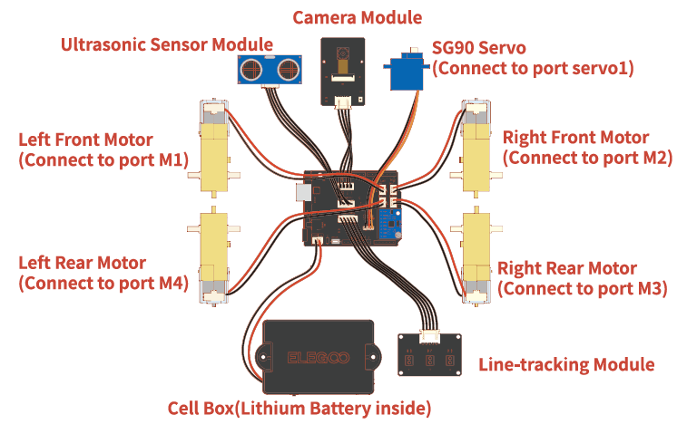

# Smart Robot Car Project  
A modular, Arduino-based robot car with autonomous and remote-controlled functionalities including line tracking, object following, and auto-follow. Designed for hobbyists and students to learn embedded systems and robotics.

## Table of Contents  

- [Smart Robot Car Project](#smart-robot-car-project)
  - [Table of Contents](#table-of-contents)
  - [Project Overview](#project-overview)
  - [Key Features](#key-features)
  - [Hardware Requirements](#hardware-requirements)
  - [Software Dependencies](#software-dependencies)
  - [Wiring Instructions](#wiring-instructions)
    - [Wiring Diagram](#wiring-diagram)

## Project Overview  
This project implements a fully functional robot car using an Arduino UNO microcontroller. It integrates sensors (ultrasonic, line tracking) and actuators (DC motors, servo) to enable both autonomous behaviors (e.g., following a line) and manual control via IR remote.  

The codebase is organized into modular files for easy customization. You can add new features (e.g., Bluetooth control, obstacle avoidance) without rewriting core logic.  

We propose to design and implement a Smart Campus Delivery Robot using an Arduino-based robotic car platform. The robot will be capable of autonomously navigating along pre-defined paths, avoiding obstacles, and receiving user requests through wireless communication. The system will also log delivery data, such as the number of completed deliveries and travel times, for later analysis. 

## Key Features  
- **Line Tracking**: Uses 3x ITR20001 reflective sensors to follow black/white lines on flat surfaces.  
- **Object Following**: HC-SR04 ultrasonic sensor maintains a target distance from objects.  
- **IR Remote Control**: Supports NEC-protocol IR remotes for manual movement (forward/backward/left/right).  
- **Servo Motor Control**: Adjusts the ultrasonic sensor’s angle for wider detection range.  
- **FPV camera**: Use ESP32-S3-WROOM-1 module. 
 

## Hardware Requirements  
List all components you used—include models/specs to help others replicate your build:  

| Component               | Model/Specifications       | Quantity | Purpose                                  |  
|-------------------------|---------------------------|----------|------------------------------------------|  
| Microcontroller         | Arduino Uno R3            | 1        | Main control unit (runs the code)        |  
| Motor Driver            | TB6612                     | 1        | Powers and controls DC motors            |  
| Gyro module             | GY-521                     | 1        | Maintains orientation and angular velocity                  |  
| Ultrasonic Sensor       | HC-SR04                   | 1        | Measures distance to objects             |  
| Line Tracking Sensor       | LTI-PCB                 | 1        | Line tracking (left/middle/right)         |  
| Servo Motor             | SG90 9g                   | 1        | Rotates ultrasonic sensor                |  
| Power Supply            | Cell box | 1        | Lithium Battery inside  |  
| Camera module                 | ESP32-S3-WROOM-1-Camera      | 1        | Transfer images to devices via hotspot components                     |  

## Software Dependencies  
List libraries needed for the code to compile—include installation instructions:  

| Library Name            | Version   | Installation Method                      | Purpose                                  |  
|-------------------------|-----------|------------------------------------------|------------------------------------------|  
| Arduino Servo Library   | 1.1.8     | Built-in (no installation needed)        | Controls SG90 servo motor                |  
| IRremote                | 3.7.0     | Arduino Library Manager → Search "IRremote" | Decodes NEC IR signals                   |  
| ArduinoJson             | 6.11.1    | Arduino Library Manager → Search "ArduinoJson" |   |  
                            

## Wiring Instructions  
Explain how to connect components to your Arduino—use a table for clarity. Reference your code’s pin definitions (e.g., `Ultrasonic.h` uses D13/D12):  

| Component Pin           | Arduino Pin | Notes                                  |  
|-------------------------|-------------|----------------------------------------|  
| HC-SR04 TRIG            | D13         | From `Ultrasonic.h`                    |  
| HC-SR04 ECHO            | D12         | From `Ultrasonic.h`                    |  
| L298N PWMA              | D5          | From `Move_control.cpp` (Motor A speed) |  
| L298N PWMB              | D6          | From `Move_control.cpp` (Motor B speed) |  
| L298N AIN1              | D7          | From `Move_control.cpp` (Motor A dir)   |  
| L298N BIN1              | D8          | From `Move_control.cpp` (Motor B dir)   |  
| L298N STBY              | D3          | From `Move_control.cpp` (Motor enable)  |  
| SG90 Servo Signal       | D10         | From `Servo_Control.h`                  |  
| ITR20001 Left           | A2          | From `Tracking.h`                      |  
| ITR20001 Middle         | A1          | From `Tracking.h`                      |  
| ITR20001 Right          | A0          | From `Tracking.h`                      |  
| IR Receiver VCC         | 5V          | Power for IR module                    |  
| IR Receiver GND         | GND         | Ground for IR module                    |  
| IR Receiver Signal      | D2          | From `IRremote.h`                      |  

### Wiring Diagram  

     
   *Figure 1: Wiring diagram for all components*