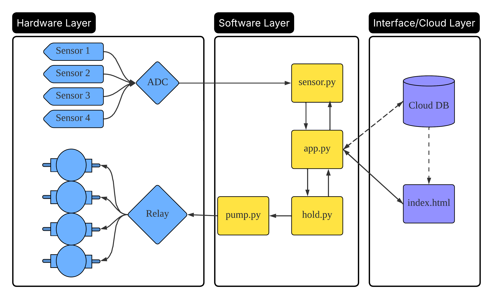
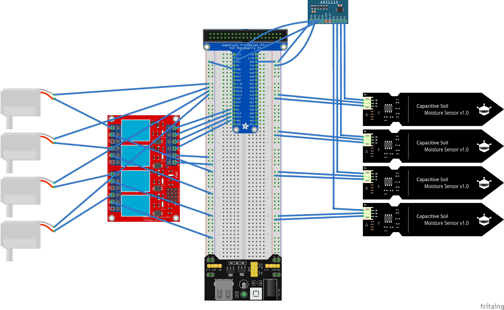
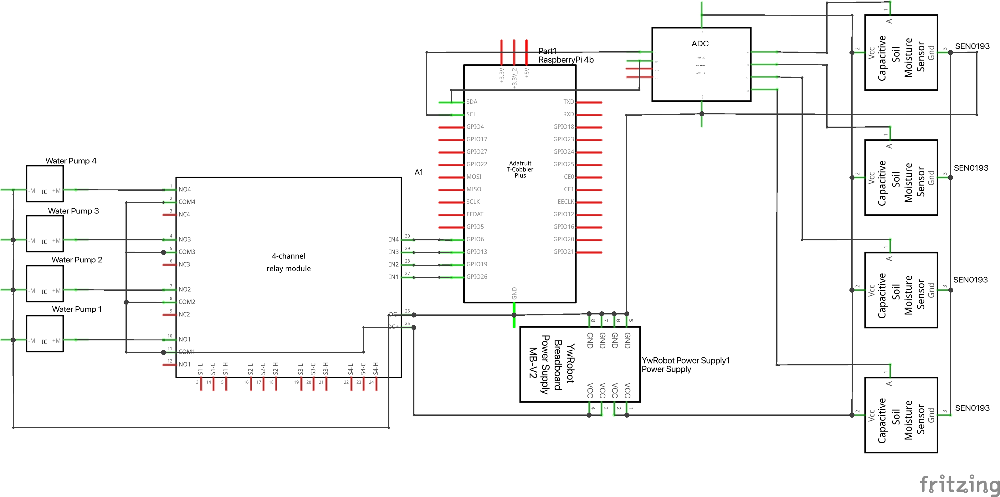

# Smart Watering System 🌿💧

A lightweight **IoT-based smart irrigation system** running on **Raspberry Pi**.  
It continuously monitors real-time soil humidity, automatically waters each plant based on its threshold, and synchronizes all data to the cloud with a responsive web dashboard for remote control and monitoring.

## Key Features ⭐

- 🚿 **Auto + Manual Watering** — Supports automatic watering by humidity threshold or one-click manual watering from the web dashboard (with configurable duration).  
- 🌡️ **Real-Time Humidity Sensing** — Uses **ADS1115 (I²C)** to read multiple soil sensors and normalize values to 0–100%.  
- 🔌 **Safe Pump Control** — Relay driven in **BCM mode**, initialized to a safe HIGH state. Provides `on()`, `off()`, and `pulse()` functions with automatic GPIO cleanup.  
- ⏱️ **Scheduled Sampling** — Reads sensors every hour (aligned to the top of the hour) and on-demand when the page loads.  
- ☁️ **Cloud Sync** — Logs time-series data to **Firebase Realtime Database** for remote visualization.  
- 📊 **Web Dashboard** — Built with **Tailwind + Chart.js**, showing live humidity status and history charts for each plant.  
- 🧩 **Modular Code Design** — `sensor.py` (sensing), `pump.py` (relay control), `hold.py` (timing & state), and `app.py` (Flask logic).  
- 🛡️ **Robust and Safe** — Error-tolerant readings, maximum watering timeout, and safe GPIO reset on exit.

> The system architecture is simple yet extensible — ideal for coursework demonstrations and future enhancements such as weather-based control or multi-zone expansion.

## System Architecture 🧠

The overall architecture of the **Smart Watering System** is shown below:

<div align="center">
  
</div>

 ## Hardware Setup 🔌

### 🧰 Components Used

| Component                                                    | Quantity | Description                                   |
| ------------------------------------------------------------ | :------- | --------------------------------------------- |
| [**Raspberry Pi 4B**](https://www.amazon.ca/dp/B0B2NY1SMT)   | 1        | Main controller running the Flask app.        |
| [**4-Channel Relay Module (5 V)**](https://www.amazon.ca/dp/B06XCKQ1M9) | 1        | Controls four water pumps via GPIO.           |
| [**Capacitive Soil Moisture Sensor**](https://www.amazon.ca/dp/B07H3P1NRM) | 4        | Analog output soil sensors (0–3 V).           |
| [**ADS1115 16-bit ADC (I²C)**](https://www.amazon.ca/dp/B0BXWJFCVJ) | 1        | Converts analog signals to digital via I²C.   |
| [**Mini  Water Pump**](https://www.amazon.ca/dp/B095VSB54J)  | 4        | Driven by the relay for watering.             |
| [**Breadboard Power Supply**]()                              | 1        | Provides 5 V rail for sensors and relays.     |
| [**T-Type GPIO Extension Module**](https://www.amazon.ca/dp/B07MX5T3LM) | 1        | GPIO breakout for Raspberry Pi to breadboard. |
| [**Jumper Wires + Breadboard**](https://www.amazon.ca/dp/B09Y1LTF1R) | —        | For all connections.                          |

---

### 🔗 Wiring Overview

<div align="center">
  
</div>

**Highlights:**

- Moisture sensors → ADS1115 A0–A3  
- ADS1115 → Pi (SDA = GPIO2, SCL = GPIO3)  
- Relays → Pi GPIO
- Relay VCC → 5 V, GND → GND  
- All grounds **must be connected together** (Pi GND ↔ ADC GND ↔ Relay GND ↔ External Power GND)

---

### ⚙️ Circuit Schematic

<div align="center">
  
</div>


> **Tip:**  
> If your moisture sensors output above 3.3 V, power the ADS1115 with 5 V or use a resistor divider to avoid damaging the ADC.

## How to Install 🚀

This project runs on [**Python 3**](https://www.python.org/downloads/) and requires several third-party libraries, which can all be installed via **pip**.  Before you begin, please make sure you are using **Python 3.8 or higher** to avoid compatibility issues.

### 1. Clone the Repository

```bash
git clone https://github.com/JetRoboticAI/cps-fall-2025.git
cd cps-fall-2025/SmartWateringSystem_Group4/
```

### 2. Set Up the Environment

```bash
python3 -m venv .venv
source .venv/bin/activate
pip install -r requirements.txt
```

### 3. Configure the System

* Edit **config.json** to match your hardware and environment:
    - 🌐 **Firebase Realtime Database URL** 
    - ⚙️ **Web Port Configuration** 
    - 🌡️ **Sensor Calibration Values** 
    - 💧 **Pump GPIO Pin Mapping**

### 4. Run the Application

```bash
python app.py
```
